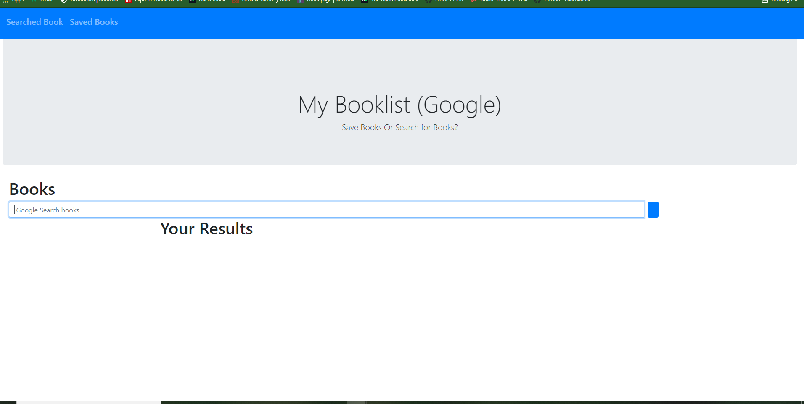

# Google-Book List 
This Google Book-List application will allow the user to search and save books. The book will display and have a brief description of the book, as well as display the author and the ability of showing you where to purchase the book. This Google Book-list uses Google Book API to search and view books. 

# Installation
<Ul>
<li> React </li>
<li> Axios </li>
<li> MongoDB </li>
<li> Mongoose </li>
<li> Bootstrap </li>
<li> Express </li>
<li> Google Book API </li>
</Ul>

# Heroku Link
<a href="https://booklist-create-react.herokuapp.com/"> Visit Google BookList! </a>

# Author
Ligaya Herndon

# ScreenShot
